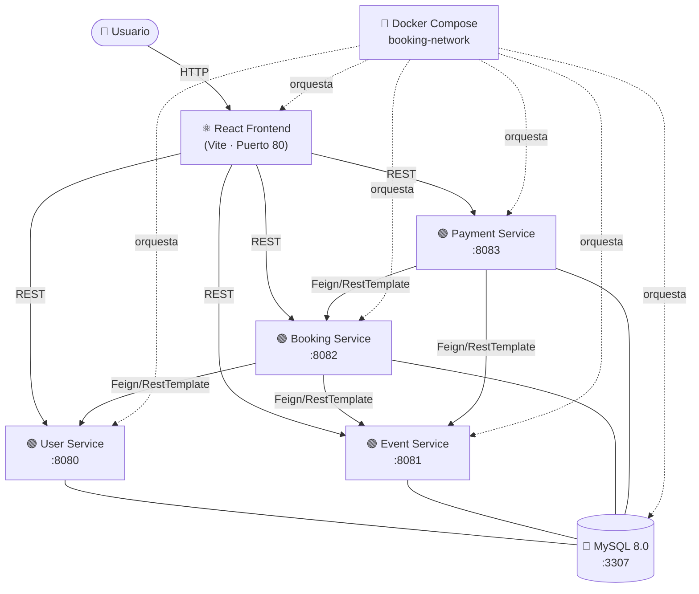
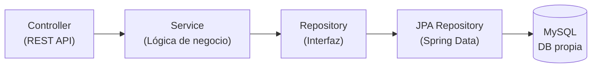
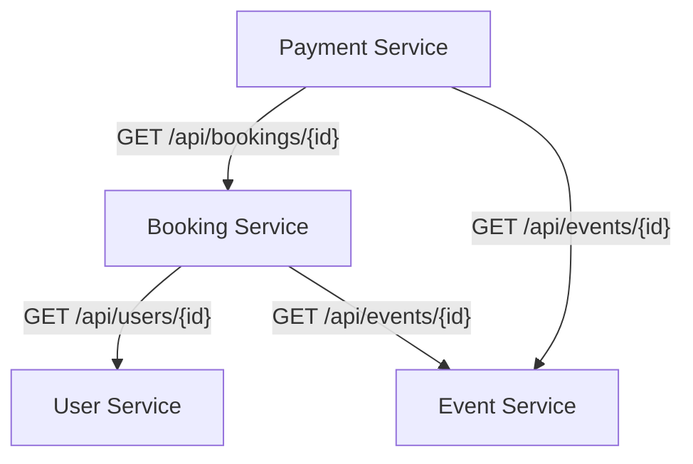
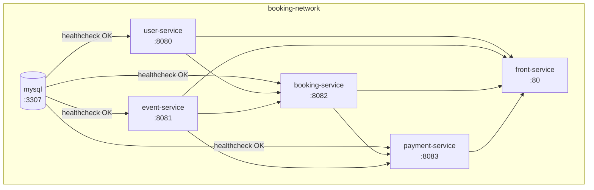
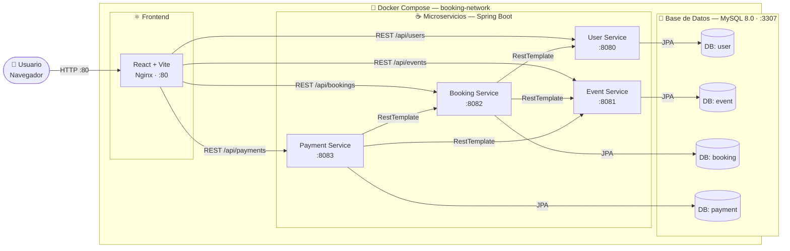

# Arquitectura del Proyecto — Booqi

## Mapa Conceptual General



> Cada microservicio posee su propia base de datos dentro de MySQL (patrón **DB per Service**).

---

## Estructura de Capas por Microservicio

Todos los servicios backend siguen la misma arquitectura en capas:



| Capa | Clase representativa | Responsabilidad |
|---|---|---|
| **Controller** | `*Controller.java` | Recibir peticiones HTTP, validar entrada |
| **Service (interfaz)** | `*Service.java` | Contrato del dominio |
| **Service (impl)** | `*ServiceImpl.java` | Lógica de negocio |
| **DTO** | `*CreateDTO / *ResponseDTO` | Transferencia de datos entre capas |
| **Mapper** | `*Mapper.java` (MapStruct) | Conversión DTO ↔ Modelo |
| **Repository (interfaz)** | `*Repository.java` | Contrato de persistencia |
| **Repository JPA** | `*RepositoryJPA.java` | Implementación con Spring Data JPA |
| **JPA Model** | `JPA*Model.java` | Entidad JPA (`@Entity`) |
| **Config** | `CorsConfig / OpenAPIConfig` | CORS, Swagger, RestTemplate |

---

## Comunicación entre Servicios



Los clientes HTTP se implementan con `RestTemplate` en las clases `*ServiceClient.java`.

---

## Frontend — Estructura React

```
front/src/
├── api/            # Llamadas REST a cada microservicio
├── components/     # Componentes reutilizables
├── context/        # Estado global (React Context)
├── pages/          # Vistas principales
├── services/       # Lógica de servicios del lado cliente
└── utils/          # Utilidades y helpers
```

Servido con **Nginx** dentro de Docker (puerto `80`).

---

## Despliegue con Docker Compose



| Contenedor | Imagen / Build | Puerto |
|---|---|---|
| `mysql` | `mysql:8.0` | `3307:3306` |
| `user-service` | Build `../user` | `8080:8080` |
| `event-service` | Build `../event` | `8081:8081` |
| `booking-service` | Build `../booking` | `8082:8082` |
| `payment-service` | Build `../payment` | `8083:8083` |
| `front-service` | Build `../front` | `80:80` |

---

## Stack Tecnológico

| Capa | Tecnología |
|---|---|
| Frontend | React 18 · Vite · Nginx |
| Backend | Java 21 · Spring Boot · Spring Data JPA |
| Mapeo | MapStruct |
| Documentación API | SpringDoc OpenAPI (Swagger UI) |
| Base de datos | MySQL 8.0 |
| Contenedores | Docker · Docker Compose |
| Testing | JUnit 5 · Mockito · H2 (integración) · PIT (mutación) |

---

## Visión Completa — Frontend · Microservicios · BDD · Docker



| Zona | Rol | Tecnología |
|---|---|---|
| **Usuario** | Consume la UI desde el navegador | HTTP · Puerto 80 |
| **Frontend** | Renderiza vistas y llama a los servicios | React · Vite · Nginx |
| **Microservicios** | Lógica de negocio, REST API, comunicación inter-servicio | Java 21 · Spring Boot · MapStruct |
| **BDD** | Persistencia aislada por dominio (DB per Service) | MySQL 8.0 · Spring Data JPA |
| **Docker** | Orquesta contenedores en red privada compartida | Docker Compose · bridge network |
