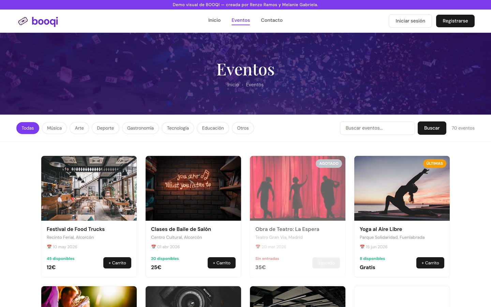
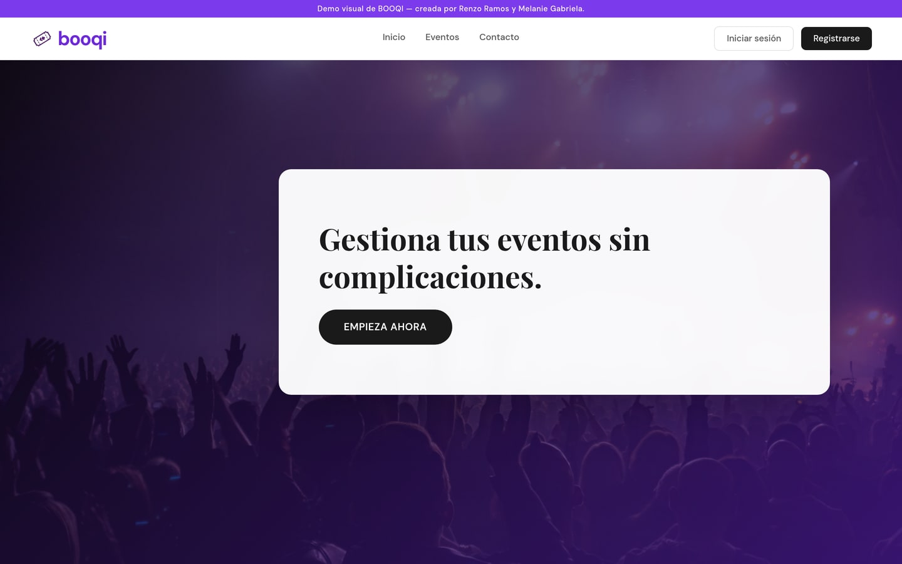
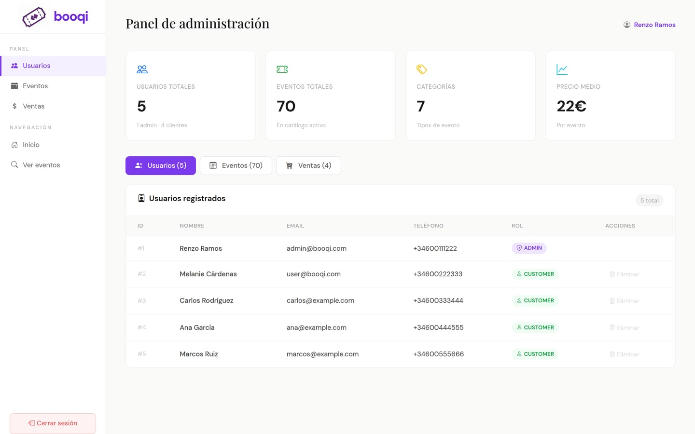
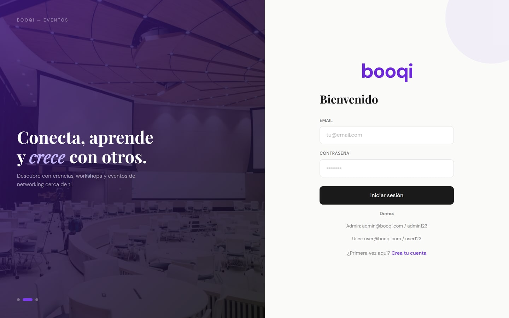
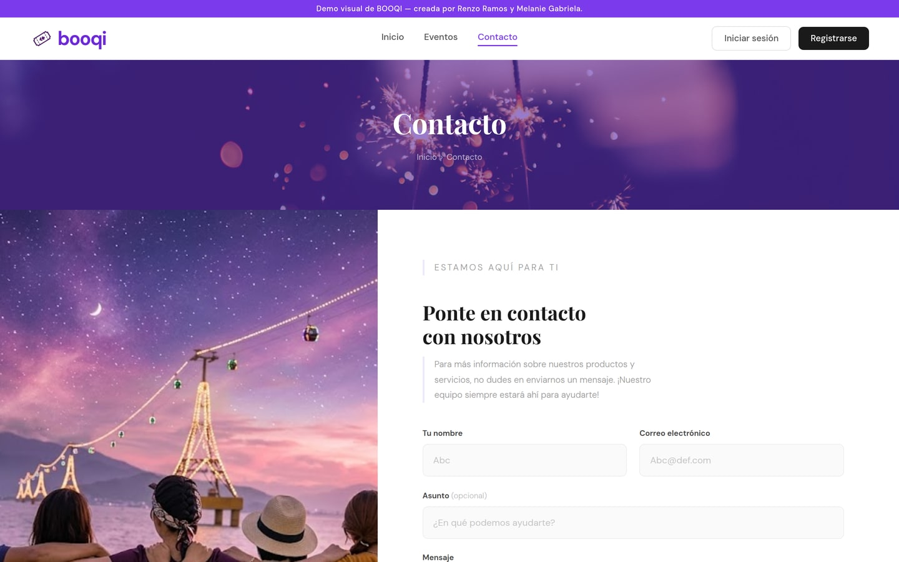

<div align="center">

# Booqi

**Sistema de gestión de reservas de eventos con arquitectura de microservicios.**

Explorar eventos, reservar entradas, pagar y generar el ticket en PDF.

[**Ver la demo →**](https://renzoramosdev.github.io/Booqui-Sistema-Gestion-Reservas-Eventos/)


</div>

> [!NOTE]
> La demo enlazada arriba es una **demo visual del frontend**, sin los microservicios detrás. El sistema completo se levanta con Docker Compose, como se explica más abajo.
>
> Repositorio original: https://gitlab.com/booqui

---

## La aplicación

<div align="center">



</div>

| Portada | Panel de administración |
|:---:|:---:|
|  |  |
| Entrada al catálogo y a los eventos destacados. | Usuarios, eventos y ventas, con las métricas del catálogo. |

| Acceso | Contacto |
|:---:|:---:|
|  |  |
| Registro y login, con cuentas de demo a la vista. | Formulario de contacto. |

---

## Qué hace

| | |
|---|---|
| 👤 | **Gestión de usuarios** — registro, autenticación y administración de perfiles |
| 🎫 | **Catálogo de eventos** — exploración y búsqueda con información detallada |
| 🛒 | **Sistema de reservas** — proceso completo de reserva de entradas |
| 💳 | **Procesamiento de pagos** — gestión de transacciones |
| 📄 | **Generación de tickets** — creación automática en PDF |
| 📊 | **Panel de administración** — gestión de eventos, reportes y estadísticas |
| 🗂️ | **Mis reservas** — historial de reservas del usuario |

---

## Arquitectura

Cuatro microservicios backend independientes, un frontend y una capa de despliegue con Docker.

| Servicio | Puerto | De qué se encarga |
|---|:---:|---|
| **User Service** | 8080 | Registro, login, perfiles, roles y permisos |
| **Event Service** | 8081 | Catálogo de eventos, capacidad, disponibilidad y categorías |
| **Booking Service** | 8082 | Creación y consulta de reservas, y validación de disponibilidad |
| **Payment Service** | 8083 | Procesamiento de pagos y estado de las transacciones |

Cada microservicio tiene **su propia base de datos** (`user`, `event`, `booking`, `payment`), siguiendo el patrón *Database per Service*. Se comunican entre sí por **REST con `RestTemplate`**: Booking consume User y Event; Payment consume Booking y Event.

### Vistas del frontend

Home · Events · Event Detail · Cart · Checkout · My Bookings · Login/Register · Admin Panel · Contact

---

## Stack

### Backend

| Tecnología | Versión | Para qué |
|---|---|---|
| Java | 17 | Lenguaje principal |
| Spring Boot | 4.0.3 | Framework de las aplicaciones |
| Spring Data JPA | — | Persistencia y acceso a datos |
| Spring Web | — | APIs RESTful |
| Spring Validation | — | Validación de datos |
| MySQL | 8.0 | Base de datos relacional |
| Lombok | — | Menos código repetitivo |
| MapStruct | 1.5.5 | Mapeo de objetos |
| SpringDoc OpenAPI | 2.3.0 | Documentación automática de las APIs |
| Maven | — | Dependencias y build |

### Frontend

| Tecnología | Versión | Para qué |
|---|---|---|
| React | 19.2.0 | Interfaz de usuario |
| Vite | 7.3.1 | Build y servidor de desarrollo |
| React Router DOM | 7.13.1 | Enrutado |
| Axios | 1.13.5 | Cliente HTTP |
| Bootstrap | 5.3.8 | Diseño responsivo |
| Bootstrap Icons | 1.13.1 | Iconografía |
| PDF-Lib | 1.17.1 | Generación de los tickets en PDF |
| ESLint | 9.39.1 | Linting |

### Infraestructura

**Docker** para contenerizar cada servicio, **Docker Compose** para orquestarlos, **Nginx** sirviendo el frontend y **MySQL** como base de datos.

---

## Documentación de las APIs

Cada microservicio publica su documentación con Swagger/OpenAPI:

```
http://localhost:8080/swagger-ui.html    # User
http://localhost:8081/swagger-ui.html    # Event
http://localhost:8082/swagger-ui.html    # Booking
http://localhost:8083/swagger-ui.html    # Payment
```

---

## Despliegue

El proyecto está completamente dockerizado. Docker Compose orquesta seis contenedores:

- 1 de MySQL
- 4 de los microservicios backend
- 1 del frontend con Nginx

Con una red Docker dedicada para la comunicación entre servicios y volúmenes persistentes para la base de datos.

---

## Estructura

```
booqi/
├── user/               # Microservicio de usuarios
├── event/              # Microservicio de eventos
├── booking/            # Microservicio de reservas
├── payment/            # Microservicio de pagos
├── front/              # Aplicación frontend
└── deployment-booqi/   # Configuración de despliegue
    ├── docker-compose.yml
    └── 001_init_database.sql
```

### Patrones y prácticas

Arquitectura de microservicios · Repository Pattern · DTO · Mapper con MapStruct · Inyección de dependencias · Separación en capas (Controller, Service, Repository) · Bean Validation · CORS configurado · Healthchecks en los contenedores · Variables de entorno

---

## Desarrolladores

**Renzo Iván Ramos de los Ríos** · **Melanie Gabriela Cárdenas Hidalgo**

**Licencia**: [MIT](LICENSE)
